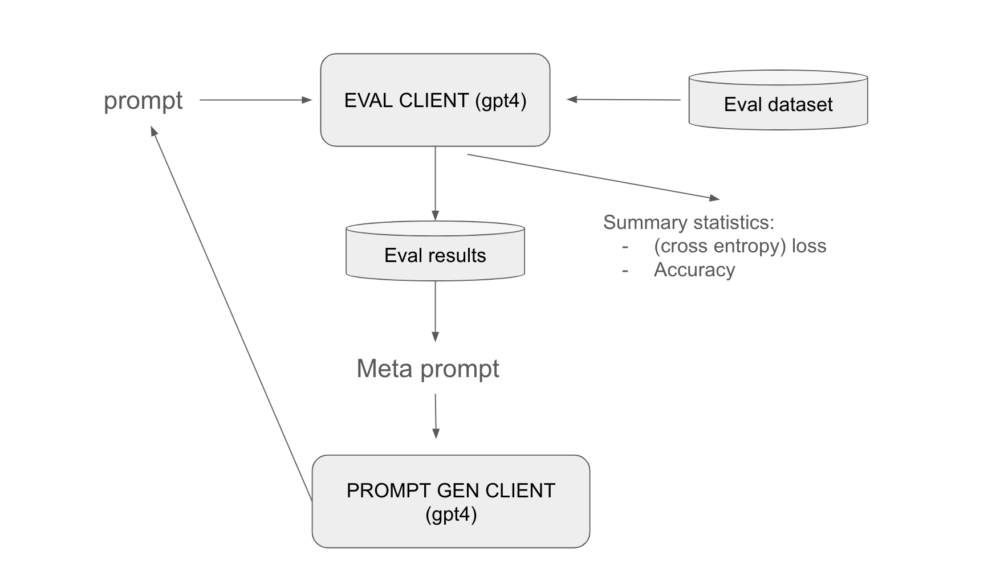
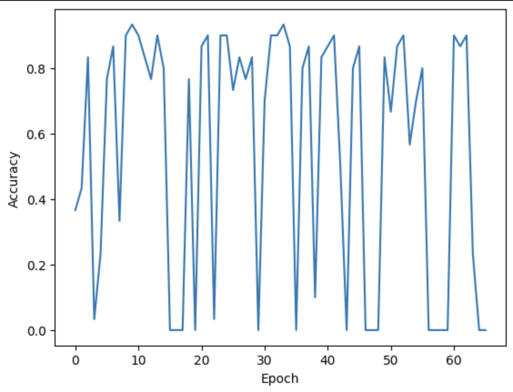

# Automated Prompt Generator

We automated the process of prompt tuning using an LLM agent and generated superb prompts from mediocre prompts and bad prompts. 


## Design


A "training" loop goes as follows:

A `prompt` is first feed into `EVAL_CLIENT` to be evaluated on a small set of examples. Then the prompt, along with its evaluation result, are passed along to `PROMPT_GEN_CLIENT` via `meta prompt` to generate the a new prompt. The `meta prompt` encourages `PROMPT_GEN_CLIENT` to mimic good prompts and discriminate against bad prompts. The goodness of a prompt is captured by the accuracy and cross entropy of its evaluation results against an desired answer.

The loop mimic reinforcement learning in the sense that the `PROMPT_GEN_CLIENT`'s output is feed back into its training data. However, here we feed in both good examples and bad examples, so that it can hopefully combine *good* and *negative bad* to come up with something *even better*. Gradient descent is replaced by few-shots learning --  we don't actually fine-tune`PROMPT_GEN_CLIENT`. 

## Training
See demo notebook. 


## Results and Findings

Remarkably, we started with two mediocre prompts (40% eval accuracy) and two gibbrish prompts (0% eval accuracy). On top of the four initial prompts, the automated prompt generation loop came up with superb prompts with 90%+ eval accuracy. 

Good prompts aren't always what you think they are. Don't judge a prompt by its look! Can you guess the eval accuracies for the following 3 prompts? (on sample_size=30)

```
MODEL_PROMPT: Reflect, comprehend, and sort the proposed evidence. Pick out the correct solution from A, B, C, or D. Release your evaluation by using just the solitary letter that encompasses the position of the correct alternative.

MODEL_PROMPT: Detailed in the scenario are four possible answers, A, B, C, or D. Decipher which choice is most applicable based on the given context and information.

Answer the question based on the article. Your only choices of answers are A, B, C, D
```

(The answer is 0.9, 0.03, and 0.4)

Here are some things that we found helpful with the training loop:

* Evaluating on a larger subset of data benefits training. This makes sense because of the diversity of examples. 

* Meta prompt by design only takes a subset of eval results. Strive for a balance between diversity (`strategy="random"`) and quality (`strategy="best_worst").

Sample training curve: 



## Examples of Generated Prompts

```
MODEL_PROMPT: Instructions: Based on the content and data provided, narrow down to the most precise response among options - A, B, C, or D. Your reaction should be simply in terms of the letter that fully justifies the correct answer.
```
Accuracy: 0.9333333333333333

```
MODEL_PROMPT: Based on the information and context provided, compute the most suitable answer between the options - A, B, C, or D. Your reply should straightforwardly be the single letter that characterizes the correct response.
```
Accuracy: 0.9333333333333333

```
MODEL_PROMPT: Refer to the given details and discussion and discern the correct response from the options A, B, C, or D. Deliver your response as the single most fitting letter.
```
Accuracy: 0.9

```
MODEL_PROMPT: Consider the details provided in the context. Select the best answer from A, B, C, and D. Please express your answer only through the relevant letter.
```
Accuracy: 0.9

```
MODEL_PROMPT: Given the context and details, deduce the most accurate answer among the provided options - A, B, C, or D. Ensure that your response consists merely of the single letter that corresponds to the correct answer.
```
Accuracy: 0.9

```
MODEL_PROMPT: Reflect, comprehend, and sort the proposed evidence. Pick out the correct solution from A, B, C, or D. Release your evaluation by using just the solitary letter that encompasses the position of the correct alternative.
```
Accuracy: 0.9

```
MODEL_PROMPT: Having thoroughly scrutinized the information and specifics provided, derive the correct response from the alternatives given - A, B, C, or D. The appropriate reaction should be submitted strictly using the singular letter affiliated with the accurate answer.
```
Accuracy: 0.9

```
MODEL_PROMPT: Upon analyzing the given information, identify the most accurate answer from the options - A, B, C, or D. Your response should simply consist of the solitary letter that denotes the correct response.
```
Accuracy: 0.9

```
MODEL_PROMPT: After thoroughly reviewing the information and context given, determine the most correct answer out of the options A, B, C, or D. Your response should be only the single letter that represents the correct choice.
```
Accuracy: 0.9

```
MODEL_PROMPT: Analyze the context and details intently, then discern the best response from the options enumerated - A, B, C, or D. Render your answer solely comprising the singular letter associated with the precise answer.
```
Accuracy: 0.9

